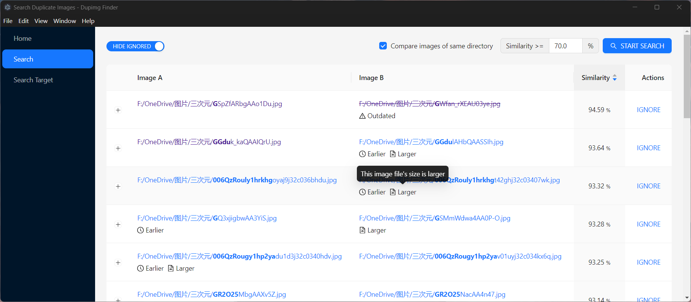

# dupimg-finder / 重复图像查找工具

Based on [EfficientIR](https://github.com/Sg4Dylan/EfficientIR).

## Usage



1. Add index paths where contain images.
2. Update index to generate the eigenvalues of images.
3. Search duplicate images using generated eigenvalues.

## Performance

Generate eigenvalues for approximately 50,000 images (≈ 170GB) takes:

| Image Processing Model | Device Type | Device Model | Time Consuming |
| ---------------------- | ----------- | ------------ | -------------- |
| `EfficientNet-B2`      | CPU         | `i5-12600KF` | 90min          |

## Developer

### Frontend Dependencies

```bash
yarn
```

### Backend Binary

Python environment is required and `pyinstaller` has been installed.

```bash
cd EfficientIR
git submodule update --init

# build passed with `python==3.12.4` and `pyinstaller==6.9.0`
pyinstaller build_nogui.spec
```

## Development

```bash
yarn dev
```

## Lint

```bash
yarn lint

# Fix resolvable lint errors
yarn lint --fix
```

## Production

```bash
yarn build
```
