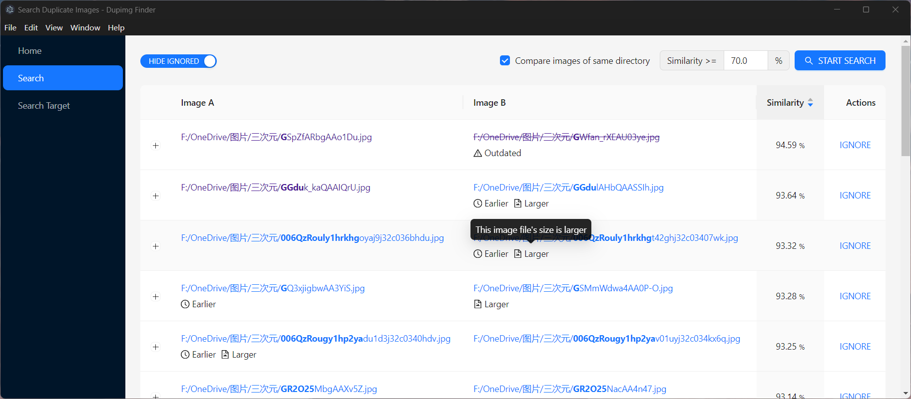

# Duplicate Images Finder / 重复图像查找工具



> Based on [EfficientIR](https://github.com/Sg4Dylan/EfficientIR).

A tool to find **duplicate image pairs** or **the most similar images of target image** in your file system. A optimized version of [EfficientNet B2](https://huggingface.co/google/efficientnet-b2) model is used to generate the eigenvalues of images behind the scenes.

## Why Write This?

Like a hamster, I love browsing sites like Pixiv, X, etc., liking and saving the pictures that give me aesthetic pleasure. The problem is that some pictures are uploaded multiple times, and I only want to keep one copy.

There are also multiple softwares that already meet my needs like [EfficientIR](https://github.com/Sg4Dylan/EfficientIR). As a front-end engineer, I want to re-implement it using modern front-end technologies while improving my native coding skills.

That's why I write this software, hope it helps save your problems, too! Pull requests are always welcomed!

## Support Platforms

- `Windows`

## Usage

[Download](https://github.com/LolipopJ/dupimg-finder/releases) and install the tool.

1. Firstly, in `Indexes` page, add paths that contain images. Subdirectories will be included.
2. Secondly, in `Indexes` page, click button to generate the eigenvalues of images. This might take a long time due to the number of images and the performance of your computer.
3. Finally, in `Search` or `Search Target` page, start a search progress using generated eigenvalues.
   - In `Search` page, you can search duplicate image pairs.
   - In `Search Target` page, you can search the most similar images of selected image.

## Performance

Duplicate Images Finder supports indexing with multiple work processes, default to `4`.

| CPU                 | Image Size                             | Time Consuming                | Branch Tag |
| ------------------- | -------------------------------------- | ----------------------------- | ---------- |
| `Inter i5-12600KF`  | approximately 50,000 images (≈ 170GB)  | 90min (with 1 work process)   | dev        |
| `AMD Ryzen 5 9600X` | approximately 100,000 images (≈ 380GB) | 55min (with 4 work processes) | v1.3.0     |

## Develop

### Backend

Python environment is required. Binary is built successfully on `python>=3.12`, other versions are not tested.

```bash
cd EfficientIR
git submodule update --init
python -m venv .venv
.venv/Scripts/Activate.ps1 # for linux or macOS, use `source .venv/bin/activate`
pip install -r requirements.txt
pyinstaller build.spec
```

### Frontend

If you need to run index or search actions, [prepare backend binary](#backend) first.

#### Install Dependencies

```bash
yarn
```

#### Development

```bash
yarn dev
```

#### Lint

```bash
yarn lint

# fix resolvable lint errors
yarn lint --fix
```

#### Production

```bash
yarn build
```
